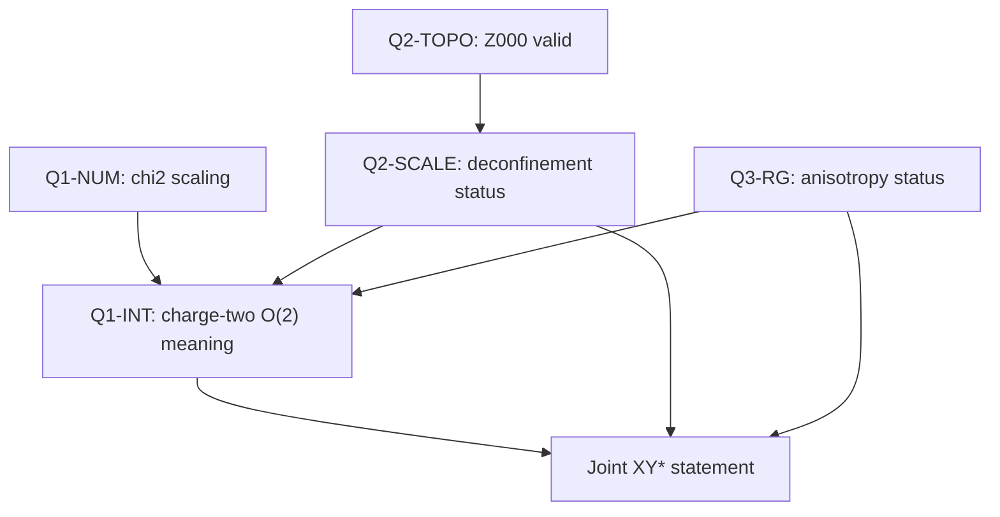
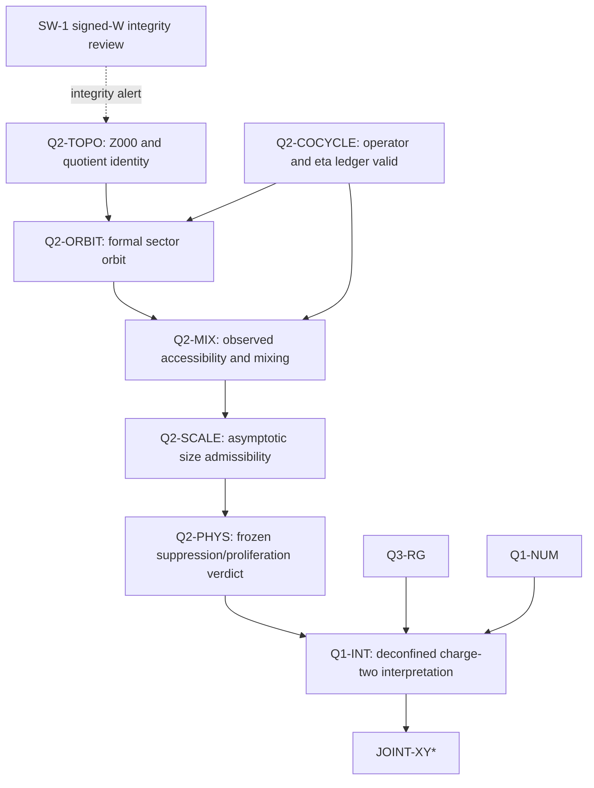

# Q1/Q2/Q3 Interpretation Dependency Graph v0.2 — Orbit/Cocycle Refinement

**Successor date:** 2026-09-02  
**Continuity:** preserves the v0.1 predecessor as a historical proposal and appends the orbit-quotient/cocycle refinement below  
**Theory/scoring effect:** none unless explicitly adopted into a new canonical protocol version

---

# Q1/Q2/Q3 Interpretation Dependency Graph v0.1

**Status:** PROPOSED / NON-CANONICAL / INSERTION-READY DRAFT  
**Addresses:** Audit Finding 2  
**Theory effect:** None unless formally adopted  
**Suggested location:** Immediately after the protocol's declaration that Q1, Q2, and Q3 are separately scored

---

## 1. Controlling Distinction

Q1, Q2, and Q3 are independent **measurement and scoring lanes**. They are not independent **interpretation premises** for the joint clean-XY\(^*\) claim.

The protocol therefore separates:

1. what was numerically measured;
2. whether the measurement was admissible and validated;
3. what fixed-point or topological interpretation the measurement can carry; and
4. whether the complete XY\(^*\) realization is supported.

No lane may silently promote its numerical result into another lane's physical conclusion.

---

## 2. The Composite Remains Defined Under Confinement

The microscopic operator

\[
\Phi_i=z_i^2
\]

is gauge invariant under \(z_i\mapsto -z_i\). Consequently, the Q1 observable \(\chi_2\) remains mathematically and numerically defined whether charge-one excitations are asymptotically deconfined, confined, or unresolved.

Q2 therefore does not determine whether Q1 can be measured.

Q2 does determine whether a Q1 exponent match may be interpreted as the charge-two representation of a deconfined critical \(O(2)\) field. If Q2 fails, the same numerical exponent may still be reported, but the deconfined charge-two interpretation is withheld.

---

## 3. Typed Result Objects

The protocol should distinguish the following objects:

| Object | Question answered | Direct dependencies |
| --- | --- | --- |
| `Q1-NUM` | Does the validated \(\chi_2\) finite-size behavior satisfy the frozen charge-two-compatible numerical criterion? | Q1 data, tuning, fit and validation rules |
| `Q1-INT` | May the Q1 numerical result be interpreted as charge-two \(O(2)\)/XY\(^*\) scaling? | `Q1-NUM`, Q2 deconfinement status, Q3 fixed-point status, other required antecedents |
| `Q2-TOPO` | Is the global-sector construction capable of representing the topology required by canonical Q2? | Appendix A validation; canonical three-axis fixed-holonomy \(Z_{000}\) construction |
| `Q2-SCALE` | On admissible scales, do the frozen Q2 diagnostics support asymptotic deconfinement rather than finite-size mimicry? | `Q2-TOPO`, Appendix B validation, confinement-scale admissibility, canonical Q2 diagnostics |
| `Q3-RG` | Does the sixfold anisotropy satisfy the frozen irrelevance criterion? | Q3 data, critical-window and drift validation |
| `JOINT-XY*` | Is the full preregistered realization supported? | `Q1-INT`, `Q2-SCALE`, `Q3-RG`, and all other required antecedent/validation gates |

The fully link-summed periodic dual \(Z_{\mathrm{full}}\), which projects out odd mod-two homology, cannot replace `Q2-TOPO`. Canonical Q2 production remains the three-axis fixed-holonomy \(Z_{000}\) ensemble defined in Appendix A.

---

## 4. Interpretation Graph



The arrows are interpretation dependencies, not instructions to reuse one lane's data in another lane's numerical fit.

---

## 5. Permitted Language by Combined Status

| Q1-NUM | Q2-SCALE | Q3-RG | Permitted interpretation |
| --- | --- | --- | --- |
| `PASS` | `PASS` | `PASS` | “Charge-two-compatible scaling with the preregistered deconfined XY\(^*\) interpretation supported.” |
| `PASS` | `FAIL` | Any valid result | “A numerical charge-two-exponent match is present, but the deconfined XY\(^*\) interpretation is rejected for this constructor.” |
| `PASS` | `INCONCLUSIVE` or `UNRESOLVED` | Any non-invalid result | “Charge-two-compatible numerical scaling is present; its deconfined interpretation remains unresolved.” |
| `PASS` | `PASS` | `FAIL` | “Composite scaling is numerically compatible, but the clean \(O(2)\) fixed-point interpretation is rejected by the anisotropy lane.” |
| `FAIL` | `PASS` | `PASS` | “The clean-lane antecedents are supported, but the preregistered charge-two scaling prediction fails for this realization.” |
| Any | Any | Any, with a required `INVALID` status | “No admissible joint interpretation.” |

An exponent match alone must be described as **compatible numerical scaling**, not as proof of deconfinement, fractionalization, or XY\(^*\).

---

## 6. No Cross-Lane Promotion

The following inferences are prohibited:

- Q1 pass \(\Rightarrow\) Q2 pass;
- Q1 pass \(\Rightarrow\) Q3 pass;
- Q2 pass \(\Rightarrow\) Q1 pass;
- Q3 pass \(\Rightarrow\) deconfinement;
- a shared critical-looking window \(\Rightarrow\) a shared asymptotic mechanism; or
- numerical agreement with the target exponent \(\Rightarrow\) unique operator identification.

Each raw lane result remains reportable even when the joint interpretation is withheld.

---

## 7. Recommended Results Schema

```json
{
  "q1": {
    "numerical_status": "PASS|FAIL|INCONCLUSIVE|UNRESOLVED|INVALID",
    "observable": "chi_2",
    "microscopic_operator": "Phi=z^2",
    "interpretation_status": "XY_STAR_SUPPORTED|COMPATIBLE_ONLY|WITHHELD|REJECTED|INVALID"
  },
  "q2": {
    "topology_status": "PASS|FAIL|UNRESOLVED|INVALID",
    "canonical_ensemble": "Z_000_three_axis_fixed_holonomy",
    "scale_status": "PASS|FAIL|INCONCLUSIVE|UNRESOLVED|INVALID"
  },
  "q3": {
    "rg_status": "PASS|FAIL|INCONCLUSIVE|UNRESOLVED|INVALID"
  },
  "joint_interpretation": "SUPPORTED|REJECTED|UNRESOLVED|INVALID"
}
```

This schema is an interpretation overlay. It must not overwrite the canonical raw measurements, fits, diagnostics, or original lane labels.

---

## 8. Non-Claims

This dependency graph does not:

- redefine \(\Phi\);
- make charge-one \(z\) gauge invariant;
- claim that confinement makes \(\chi_2\) meaningless;
- combine Q1/Q2/Q3 data into a single fitted statistic; or
- permit a joint conclusion when a required lane is unresolved or invalid.


---

## 9. Orbit/cocycle refinement of the Q2 branch



`Q2-COCYCLE` validates transition accounting. It does not determine the physical sector verdict by itself. The q-only Markov-closure question is optional and separate: failure blocks autonomous q dynamics, not use of q as the Q2 observable.
