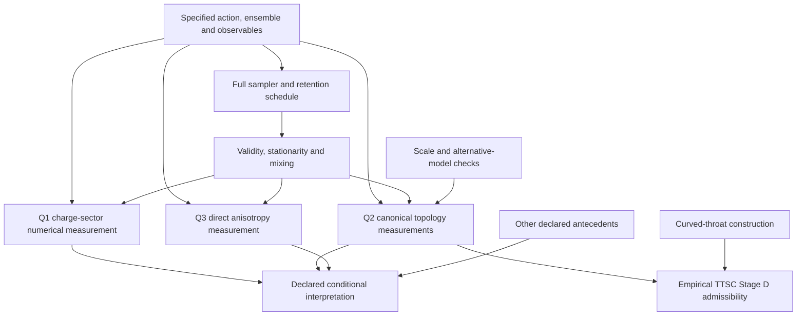

# Q1/Q2/Q3 dependency graph v0.3

The arrows below denote required inputs to a particular inference, not identities between measurements.

Q1's gauge-invariant numerical observable does not become undefined merely because Q2 fails. Its stronger interpretation may depend on additional antecedents. Q2 requires the correct fixed-reference ensemble, conserved-current branch, full-state paths, mixing and scale checks. Q3 retains its own direct estimator and model/size conditions.

The reference lattice validator checks state mathematics. The throat executable checks the continuum construction. They feed implementation review, not the missing production measurements. There is no arrow from a valid phase-screen identity or a local hash directly to a physical Q2 pass.

The reporting functions in [conditional closure](08_Conditional_Closure_v0.3.md) and [the scale branch](14_Confinement_Radius_v0.3.md) preserve these distinctions. No graph arrow authorizes changing a historical raw result.
