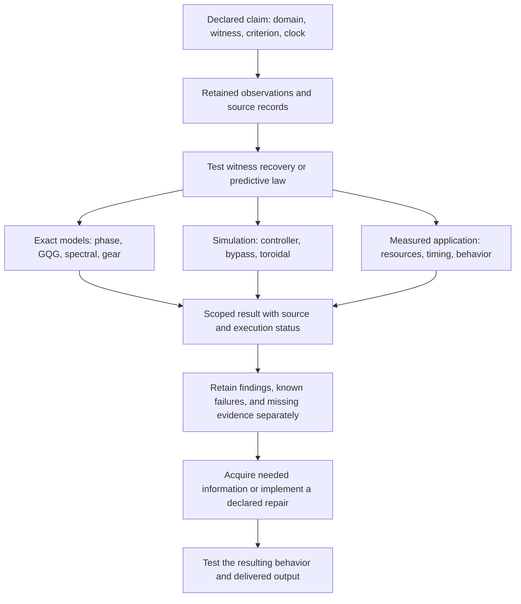

# Geometry, simulation, and thermodynamics — integration review
19 September 2026

**The checked mathematical and software components agree with the newest master. Three document repairs and one status-policy crosswalk remain. The main execution gap is the instrumented toroidal replay; the thermodynamics and human timing branches still need measured outcomes.**

The governing entry point is [00 — Geometry — Upgraded Master v0.1](https://docs.google.com/document/d/1YGYq8OqNGejONtHdEidubFazE7BIEgfcvN_fxQS48ds/edit), modified **2026-09-19 04:38:38.955 UTC**. Its useful common rule is to declare the quantity being recovered, the information retained, the domain, and the clock, then test whether those retained data determine the required result.

**Scope and limits.** This review preserved 20 current source-document snapshots and inspected the mathematical, simulation, resource-accounting, and execution-status passages listed in SOURCE_COVERAGE.md. It freshly executed the supplied GQG and phase test suites, the finite reasoning-bypass experiment, and the toroidal arithmetic verifier, and added independent bounded cross-checks. Long Monte Carlo trajectories, the triadic experiment's raw package, physical resource measurements, biological extensions, and WOBBLE's economic figures were not newly reproduced. The previous Checking/lattice audit is carried forward separately. Drive originals were left unchanged. Retrieved instructions were treated as source text. Source-reported execution and fresh execution have separate labels throughout.

## Fresh execution and independent checks

| Component | Observed in this review | What was checked |
|---|---|---|
| GQG Rune v0.3 | **29 tests passed; 0 failures, 0 errors** | Finite descent, factorization, refinement, predictive laws, parser controls, spectral examples, and 432 toroidal fixtures. |
| Geometry Maximization v2.0 phase engine | **10 tests passed** | 10,000 exact departures against an integer-square-root oracle; boundary conventions; nonzero starts; numerical-error distinctions; deterministic export. |
| Reasoning Bypass v0.1 | **1,280 intact-checker trials:** 320 accepted primary, 704 recovered, 256 unresolved, **0 wrong accepted** | Fresh seeded execution; output comparison against the archived release; independent recount of raw trials. |
| Deliberately broken checker | **128/128 wrong answers accepted** | The separate fault boundary reproduced. It is excluded from the 1,280 intact-checker denominator. |
| Toroidal arithmetic verifier | **6 exact character/convolution comparisons passed** | L=2,3,4 at one attempt and one prescribed sweep; three 70-digit local Bessel checks also ran. |
| Additional integration checks | **14 groups passed** | Includes 1,157 feasible causal-padding candidates, L=3 counts/Fourier transform, membrane rank, Bessel examples, gear arithmetic, and explicit counterexamples separating written gate rules. |

“Passed” in the last row means the stated assertion or counterexample was verified. The gate checks **confirm document differences**; they do not certify those documents as consistent.

The phase counts reproduced **5 / 39**, **53 / 507**, and **1,034 / 10,000** slips, with inter-slip gaps 9 or 10. Both copied phase source files matched the original release checksum manifest. The supplied phase implementation preserves separate exact labels, ideal-real-arithmetic certificates, and floating-point agreement flags.

The reasoning replay matched the archived CSV byte for byte. Its three other output files matched after **CRLF→LF normalization**; their raw hashes differ and are recorded. Of the 704 recoveries, **183** concern an incorrect Boolean answer and **521** concern other invalid or unusable outputs/certificates. Counting all 704 as corrected wrong answers would overstate that result.

Receipts: [fresh package runs](C:/Users/drewd/Documents/Codex/2026-09-07/worked-for-1m-19s-yes-mathematically/outputs/geometry_integration_review_20260919/FRESH_EXECUTION_RECEIPTS.json), [phase and toroidal runs](C:/Users/drewd/Documents/Codex/2026-09-07/worked-for-1m-19s-yes-mathematically/outputs/geometry_integration_review_20260919/ADDITIONAL_EXECUTIONS.json), [independent checks](C:/Users/drewd/Documents/Codex/2026-09-07/worked-for-1m-19s-yes-mathematically/outputs/geometry_integration_review_20260919/INDEPENDENT_INTEGRATION_CHECKS.json).

## 1. Thermodynamics fits the new geometry through separate measured witnesses

The master-linked v3 has a consistent accounting core:

- Energy: ΔE_store = E_in − E_out, with transfers counted once.
- Closed-system entropy: ΔS_th = Σ∫δQ_heat/T_boundary + S_gen, with S_gen ≥ 0.
- Exergy destruction relative to the stated fixed environment: B_dest = T₀ S_gen.

Energy uses joules, entropy joules per kelvin, and temperature kelvin. Open systems additionally need entropy transported by matter. These statements agree with the cited primary teaching sources: [MIT control-volume accounting](https://web.mit.edu/16.unified/www/FALL/thermodynamics/notes/node19.html), [entropy balance](https://web.mit.edu/16.unified/www/FALL/thermodynamics/notes/node48.html), and [lost work potential](https://web.mit.edu/16.unified/www/FALL/thermodynamics/notes/node49.html).

The newer §§4.1–4.3 make the geometry connection precise: two records can retain the same answer while differing in resource use, capacity change, correction, or exit. These are separate witnesses on a declared record domain. A joint witness retains all the distinctions required by its components. That is consistent with the tested product-locus rule.

**The remaining practical requirement is measurement.** The capacity equation k(t+Δt)=k(t)+g−d is an accounting identity until g and d have a specified update law or observations. A resource comparison needs a boundary, interval, units, baseline, and measured inputs/outputs. The mediation score J currently has no calibration to joules or entropy.

Source: [# Thermodynamic Coordination + Reflex Geometry · v3](https://docs.google.com/document/d/1C63lzqzNJZyMOvsXluJ0-kpNY4UIM_3RTOmaMEn5NuE/edit); [physical accounting](C:/Users/drewd/Documents/Codex/2026-09-07/worked-for-1m-19s-yes-mathematically/outputs/geometry_integration_review_20260919/sources/thermo_v3.txt:16), [resource and capacity definitions](C:/Users/drewd/Documents/Codex/2026-09-07/worked-for-1m-19s-yes-mathematically/outputs/geometry_integration_review_20260919/sources/thermo_v3.txt:79), [new geometry/timing integration](C:/Users/drewd/Documents/Codex/2026-09-07/worked-for-1m-19s-yes-mathematically/outputs/geometry_integration_review_20260919/sources/thermo_v3.txt:189).

## 2. The completed mediation comparison gives a clear, scoped result

The results source records **48 matched scenarios × 5 arms = 240 arm-episodes**, totaling **23,040 ticks**.

| Comparison | Reported result |
|---|---|
| Direct versus identity-preserving mediator, equal task information | Identical states, actions, and forecasts; zero error difference. |
| Extra cost of identity mediation | **17/500 = 0.034** in the declared modeled score J. |
| Preserved versus erased bias, context-relevant workload | Mean error **0.045058 versus 1.722141**. |
| Same erasure on the zero-bias control workload | Both mean errors **0.045058**. |
| Uncompensated three-tick delay | Large errors and failed recovery windows in the declared controller. |

The control workload matters: it isolates when the erased coordinate affects this controller. The result supports preserving relevant information, and gives no performance advantage to identity mediation over an equally informed direct controller.

The same source's Twin Timelines construction reports equal-history/opposite-next-label pairs and exact advancement of a stale phase when its age and update are known. Those findings fit the geometry distinction between **lost state** and **retained state with a known delay**. The finite controller's delay arm and the exact phase-advance construction use different rules.

Source: [03 — Triadic Mediation Results — Source Edition](https://docs.google.com/document/d/1nNN9uE78kJIu_tHDLAiumAPff32wqUosGTaNlFJI1VI/edit), [experiment and comparisons](C:/Users/drewd/Documents/Codex/2026-09-07/worked-for-1m-19s-yes-mathematically/outputs/geometry_integration_review_20260919/sources/triadic.txt:8). Execution remains source-reported in this review.

## 3. Timing now has a useful optimization theorem

For fixed readiness R≥0, permissible release Y≥R, and a fixed mean release budget E[Y]=m, the declared threshold release Y*=max(R,T) satisfies

**Var(Y) − Var(Y*) ≥ E[(Y−Y*)²] ≥ 0.**

The pointwise identity in the source establishes the result under its finite-second-moment assumptions. An independent finite enumeration verified it for **1,157** feasible candidate release vectors.

Its concrete example also checks: equally frequent readiness at 40/400 ms, padded at 180 ms, becomes 180/400 ms. Mean latency rises **220→290 ms** while population SD falls **180→110 ms**. This is an exact timing tradeoff. The planned user-outcome experiment has its own separate tradeoff and interaction tests.

The sequence example checks too: (40,40,160,160) and (40,160,40,160) have the same mean, SD, and first entry, but different next entries. Retaining those three summaries does not close the next-observation rule.

Source: [# Temporal exchange rate](https://docs.google.com/document/d/1obKlNpy47T8Km074kHQ499KUH3Z1Q47nhRC8GUEE7rA/edit), [causal-padding proof](C:/Users/drewd/Documents/Codex/2026-09-07/worked-for-1m-19s-yes-mathematically/outputs/geometry_integration_review_20260919/sources/temporal.txt:139), [sequence collision](C:/Users/drewd/Documents/Codex/2026-09-07/worked-for-1m-19s-yes-mathematically/outputs/geometry_integration_review_20260919/sources/temporal.txt:178), [two distinct experimental contrasts](C:/Users/drewd/Documents/Codex/2026-09-07/worked-for-1m-19s-yes-mathematically/outputs/geometry_integration_review_20260919/sources/temporal.txt:210).

## 4. Toroidal mathematics and simulation evidence remain properly separated

The current master carries signed integer winding on the divergence-free domain, modular-six cut flux on the sourced domain, and distinct direct and dual ensembles. These definitions agree with Field Theory Update v0.3 and Simulation Protocol v0.5.

The all-orders sector-memory argument has an additional step beyond a hidden-state collision: finite Markov order would force A²u=cAu for the killed self-adjoint operator. Valid large-current states violate that identity through a nonzero asymptotic correction. The argument keeps its fixed attempted-microtick clock and ideal unbounded-current kernel. The six finite arithmetic cases freshly reproduced here support the displayed calculations.

The L=3 follow-up arithmetic also checks:

- New direct counts sum to **320,000**, with minimum **104** against threshold 100.
- Original direct counts sum to **80,000**, with minimum **33**; four bins missed the threshold.
- All eight displayed follow-up Fourier probabilities reproduce from the supplied counts.
- All eight reported interval screens fit within the stated 4-percentage-point margin.
- An independent periodic-boundary matrix calculation gives **rank 52, nullity 29** at L=3, consistent with 2²⁹ membrane offsets.
- Independent numerical Bessel sums reproduce the two conditional examples. These numerical checks do not supply a new certified infinite-tail enclosure.

The follow-up's engineering PASS and the original pilot's UNRESOLVED status are consistent because they refer to separate cohorts. The raw-count gate and engineering comparison do not settle production mixing.

**Concrete replay gap:** the handoff identifies a sampler that hashes the supplied configuration without parsing it to enforce the profile. Its CLI can alter schedule settings. Completion requires the specified configuration-enforcing adapter, lossless event and checkpoint recorder, restart handling, and coverage-aware validator, followed by the frozen replay. A configuration hash alone cannot establish that its settings were executed.

The historical accepted-update discrepancy remains **−1,352**. Replacement full replay and physical Q2 remain **NOT_RUN** in the reviewed sources.

Sources: [TOROIDAL — Working Master](https://docs.google.com/document/d/1NV7JsFuqJJVjFzYcqCAuC22y_rrjCSqqcZWZKobcGoU/edit); [all-orders proof](C:/Users/drewd/Documents/Codex/2026-09-07/worked-for-1m-19s-yes-mathematically/outputs/geometry_integration_review_20260919/sources/toroidal_theorem.txt:40); [L=3 counts and comparisons](C:/Users/drewd/Documents/Codex/2026-09-07/worked-for-1m-19s-yes-mathematically/outputs/geometry_integration_review_20260919/sources/l3_followup.txt:50); [conditional and membrane calculations](C:/Users/drewd/Documents/Codex/2026-09-07/worked-for-1m-19s-yes-mathematically/outputs/geometry_integration_review_20260919/sources/l3_pilot.txt:17); [implementation requirements and source finding](C:/Users/drewd/Documents/Codex/2026-09-07/worked-for-1m-19s-yes-mathematically/outputs/geometry_integration_review_20260919/sources/toroidal_handoff.txt:123). The Bessel defining series was checked against [NIST DLMF 10.25.2](https://dlmf.nist.gov/10.25.E2).

## 5. Gear and spectral additions fit the same test

The gear extension separates determination, sensitivity, and global validity. A quantity can be exactly determined yet highly sensitive to a small change. Its strong-convexity bound and uniform-gap enclosure retain explicit assumptions. Fresh arithmetic reproduced the three involute contact ratios, full-reversal backlash, and the **363,600 material cycles/hour** example. The preceding review already checked the endpoint-profile collision; its full symbolic audit is source-reported here.

The supplied GQG tests reproduced the declared spectral examples: equal squared spectra with eta values **+1/2 and −1/2**, and equal endpoint spectral labels with spectral flows **0 and 1**. These are operator/path witnesses with specified domains. The current documents require an additional model map before attaching them to a toroidal state.

Sources: [gear extension §§7–8](C:/Users/drewd/Documents/Codex/2026-09-07/worked-for-1m-19s-yes-mathematically/outputs/geometry_integration_review_20260919/sources/gear.txt:822); [spectral examples](C:/Users/drewd/Documents/Codex/2026-09-07/worked-for-1m-19s-yes-mathematically/outputs/geometry_integration_review_20260919/sources/spectral.txt:51); [NIST Hurwitz-zeta identity](https://dlmf.nist.gov/25.11.E13). The general factorization test applies across these examples; each physical or computational interpretation retains its own variables.

The same source's algorithm handover records separate implementation defects: Hager–Zhang gradient/evaluation bookkeeping, incorrectly combined D-vine conditioning, and a repeated-call failure in Hopcroft–Karp. These remain source-reported findings for those standalone prototypes. The fresh GQG suite does not exercise them. See [the algorithm review summary](C:/Users/drewd/Documents/Codex/2026-09-07/worked-for-1m-19s-yes-mathematically/outputs/geometry_integration_review_20260919/sources/spectral.txt:10).

## Document repairs and status crosswalk

| Priority | Located issue | Concrete repair |
|---|---|---|
| 1 | **WOBBLE contains two different Watch rules.** §5 says “Phase III Watch requires cascade-level interaction”; §7 says “Two loops Acute simultaneously = Phase III Watch,” and then separately defines reinforcing loops as Cascade. Two simultaneous, non-reinforcing acute loops distinguish the rules. | Adopt one versioned Watch rule and one Cascade rule; record acute count, time overlap, and observed reinforcement separately. Re-score only after that rule is frozen. |
| 2 | **Triadic v2.1 retains a blanket NOT_RUN statement.** §9 says “The comparative A/B/C performance experiment has not yet been run.” The newer results source records one completed software instantiation, and the current master already calls for scoped replacement wording. | State that TOH-MED-001-v0.1 ran; link its result; retain separate untested application-level benefit and actual resource economics. Update §9, §9.1 and the closing revision record together. |
| 3 | **Two native Docs share the thermodynamics v3 title.** The master-linked document contains §§4.1–4.3. The other lacks them even though its modification timestamp is about ten minutes later. | Identify the governing copy by document ID and master link. Give the other a clear predecessor/superseded label. The content diff is preserved. |
| Integration decision | **Unknown and failure use different reporting conventions.** Thermo/Omnibus maps any unknown gate coordinate to UNRESOLVED; the newer answer-validation master preserves a known failure when another field is unknown. | Keep the original gate result and record known violations and coverage separately. Explicitly define any cross-domain summary; do not silently replace either domain's rule. |

Locations: [WOBBLE §5](C:/Users/drewd/Documents/Codex/2026-09-07/worked-for-1m-19s-yes-mathematically/outputs/geometry_integration_review_20260919/sources/wobble.txt:309) and [§7 transition rules](C:/Users/drewd/Documents/Codex/2026-09-07/worked-for-1m-19s-yes-mathematically/outputs/geometry_integration_review_20260919/sources/wobble.txt:735); [Triadic §9](C:/Users/drewd/Documents/Codex/2026-09-07/worked-for-1m-19s-yes-mathematically/outputs/geometry_integration_review_20260919/sources/triadic_hypothesis.txt:281) and [§9.1](C:/Users/drewd/Documents/Codex/2026-09-07/worked-for-1m-19s-yes-mathematically/outputs/geometry_integration_review_20260919/sources/triadic_hypothesis.txt:299); [thermo gate](C:/Users/drewd/Documents/Codex/2026-09-07/worked-for-1m-19s-yes-mathematically/outputs/geometry_integration_review_20260919/sources/thermo_v3.txt:151), [Omnibus gate](C:/Users/drewd/Documents/Codex/2026-09-07/worked-for-1m-19s-yes-mathematically/outputs/geometry_integration_review_20260919/sources/omnibus.txt:269), [new master validation rule](C:/Users/drewd/Documents/Codex/2026-09-07/worked-for-1m-19s-yes-mathematically/outputs/geometry_integration_review_20260919/sources/current_master.txt:41).

The status-policy enumeration has **50 of 81** possible four-coordinate vectors containing both a failure and an unknown. Their single summary labels differ under the two policies. These are constructed policy cases, not 50 observed incidents or mathematical errors. A record such as `gate_status=UNRESOLVED; known_violations=[C_bind]; coverage=INCOMPLETE` preserves the constitutional rule and the established component finding.

See [thermo content diff](C:/Users/drewd/Documents/Codex/2026-09-07/worked-for-1m-19s-yes-mathematically/outputs/geometry_integration_review_20260919/THERMO_DUPLICATE_DIFF.txt) and [gate-policy cases](C:/Users/drewd/Documents/Codex/2026-09-07/worked-for-1m-19s-yes-mathematically/outputs/geometry_integration_review_20260919/GATE_POLICY_COMPARISON.json).

## Integration map

Arrows describe the review and testing workflow. They do not assert an internal platform route or a physical causal connection between the model families.

## Next work, tied to the newest master

1. **Synchronize the four reporting issues above.** They can change what a reader or a future program concludes even when the underlying calculations are correct.
2. **For the conversational-service objective, implement AS-001's acceptance cases and delivery receipts.** Preserve the previous completed lattice-test failures; this review adds no new Checking-suppression trial. See the [preceding source and empirical review](C:/Users/drewd/Documents/Codex/2026-09-07/worked-for-1m-19s-yes-mathematically/outputs/geometry_drive_review_20260919/FINDINGS.md).
3. **For the toroidal objective, finish the pinned-profile execution layer and run its validation cases before the full replacement replay.** The source handoff already specifies the necessary inputs and checks.
4. **For thermodynamic or timing benefit, define one paired process comparison and measure the required witnesses.** Bind the task, initial conditions, available information, resource boundary, clock, outcome, and uncertainty rule. This supplies the missing data needed to evaluate benefit.

The principal improvement is operational: the geometry now states what each experiment must retain and what a successful result must establish. The verified model components are usable; the remaining application work has identifiable inputs, measurements, and completion conditions.
